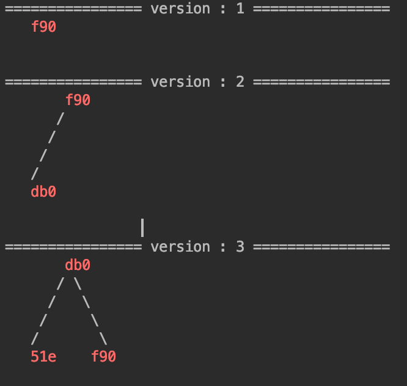
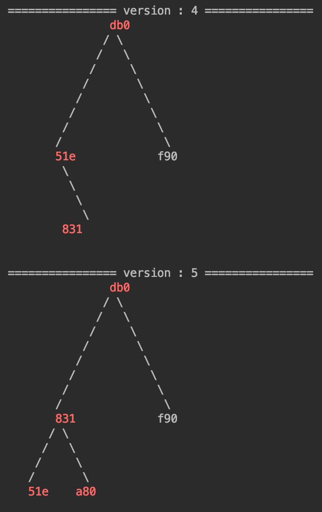
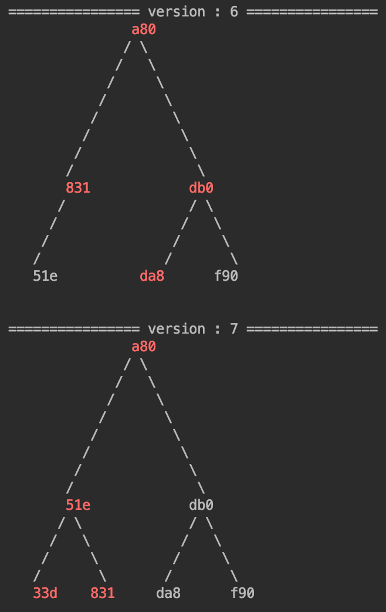
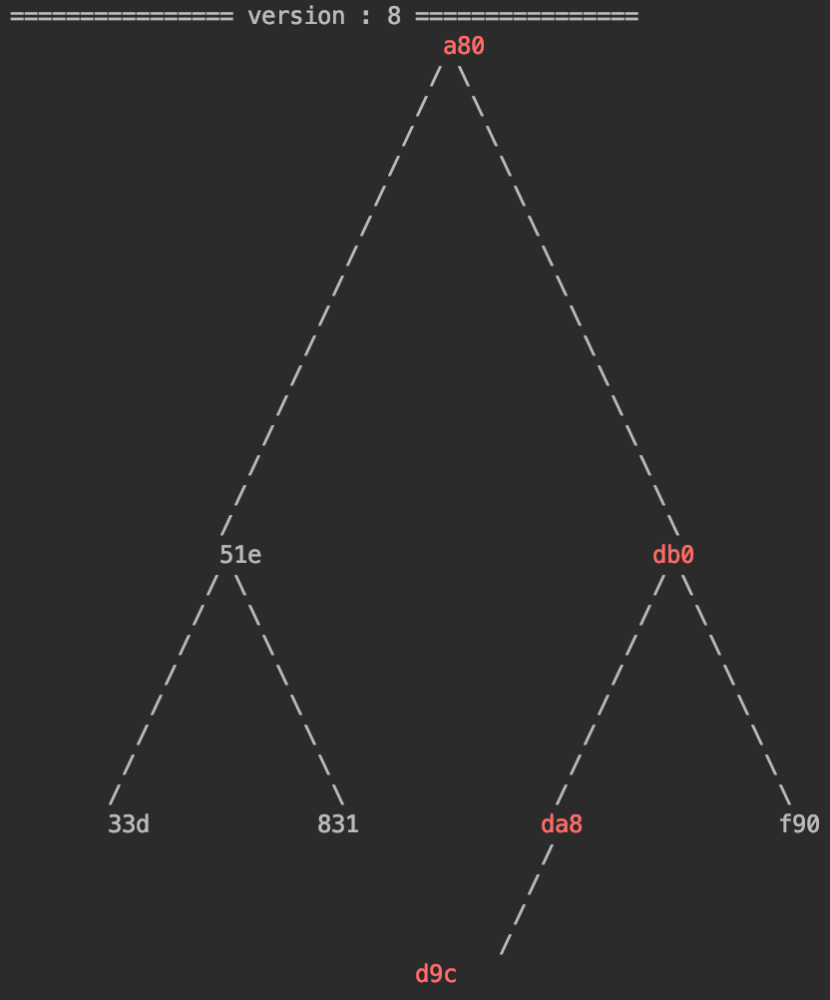

### Mercle Tree
- Java로 구현된 Mercle Tree이다.
- 해당 트리는 Balanced Tree의 한 종류인 AVL 알고리즘을 이용하여 구현하였다.
- 또한 각 블록높이 마다의 버젼을 관리한다. (각 블록높이로 로드하여 해당 시점 데이터를 조회할 수 있다.)  

### Java Example
```shell
Store<String, Account> store = new LevelDBStore("/tmp/store", null);
MercleTree<String, Account> mercleTree = new MercleTree(1l, store, false);
Account account = new Account("f58d6a22b5ae704f4e37d6dd2dc07602b11c1800", new BigInteger("100"));
mercleTree.put(account.getAddr(), account);
byte[] rootHash = mercleTree.commit(1l);
```

### Tree Version Graph




